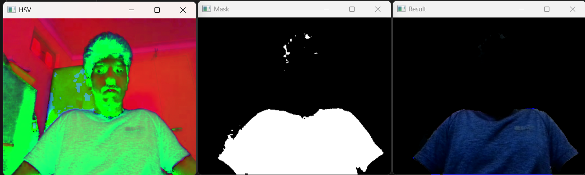

# Real-Time Color Filter using OpenCV

## Project Overview
This project uses OpenCV to apply real-time color filtering through a webcam. The user can input a color name (e.g., red, blue, green), and the system isolates that color while grayscaling the rest of the image.

---

## Tools & Libraries
- Python
- OpenCV
- NumPy

---

## Features
- Real-time webcam input
- Dynamic HSV masking based on color name
- All other colors grayscaled for highlight effect

---

## Sample Output

### Red Color Isolated

